# homekit-camera-icons
HomeKit icons for dummy camera feeds for exposing device controls on AppleTV

## Introduction

As an avid HomeKit user, I have always been puzzled why I could not control my Home through the AppleTV.
That is, until I added a HomeKit Secure Video (HSV) camera, and discovered that suddenly I was allowed to 
control HomeKit devices _in the room_ the camera was installed.

For reasons only Apple knows this limitation can actually be exploited using the fabulous 
[Homebridge](https://homebridge.io) solution in combination with the 
[Homebridge Camera FFmpeg](https://github.com/homebridge-plugins/homebridge-camera-ffmpeg) plugin.

By configuring a dummy camera stream for each of the HomeKit room(s) you want to control from your AppleTV, 
you can in fact expose most of the HomeKit accessories in that room and control them directly from your TV.
Nifty!

## Installation

You will need the following up and running in your house _before_ configuring this feature.

1. A running [Homebridge](https://homebridge.io) server (I use a [Raspberry Pi 4](https://www.raspberrypi.com) for this, and it works great!)
2. Search the Homebridge UI for plugin [Homebridge Camera FFmpeg](https://github.com/homebridge-plugins/homebridge-camera-ffmpeg) and install it successfully.
3. Configure the Homebridge Camera FFmpeg plugin as a child bridge for optimal performance.
4. Download images from this repo and upload them to your Homebridge server at a path of your choice where Homebridge have read access.

## Configuration

You can add as many rooms (=dummy cameras) as you want in the Camera FFmpeg plugin configuration, and the config you use _per room_ for 
streaming a still image as a video stream is:

```
{
  "name": "Living room",
  "videoConfig": {
    "source": "-loop 1 -re -f image2 -framerate 15 -pix_fmt yuv420p -i /home/pi/homekit-camera-icons/output/livingroom_en.png",
    "stillImageSource": "-i /home/pi/homekit-camera-icons/output/livingroom_en.png",
    "audio": false,
    "mapvideo": "0:v",
    "mapaudio": "",
    "vcodec": "h264_v4l2m2m",
    "acodec": "none",
    "additionalCommandline": "-preset ultrafast -tune StillImage -crf 28 -r 2",
    "maxStreams": 1,
    "maxWidth": 1920,
    "maxHeight": 1080
  }
}
```

**Note:** I am by no means a ffmpeg expert, but I tried tuning the above config to limit CPU load for the Raspberry Pi, 
as it will need to transcode the image into live video stream for AppleTV to accept it as a camera.

In the example above I have uploaded the images in this repo to my Raspberry Pi at path ```/home/pi/homekit-icons/```
and configured one room (=dummy camera) for my Living room using the image ```/home/pi/homekit-icons/livingroom_en.png```. 

Once the room (=dummy camera) is added to Camera FFmpeg plugin, restart the child bridge and then pair the newly added
dummy camera using the Home app on your iPhone. There is a QR code in the plugin configuration for you to scan for each
room (=dummy camera) instance you add. During the Home app setup you need to assign this camera instance to a room in
HomeKit (in my instance Living room), and then you can access and control HomeKit devices from the AppleTV by accessing
the "Living room" camera.

## Camera feed examples

Below are the English variants of each room. Click any thumbnail to view the full 1920×1080 image.
The same icons are also available in Norwegian, Swedish, Danish, Finnish, German, French and Spanish
(see the `output` directory).

| | | |
|:---:|:---:|:---:|
| [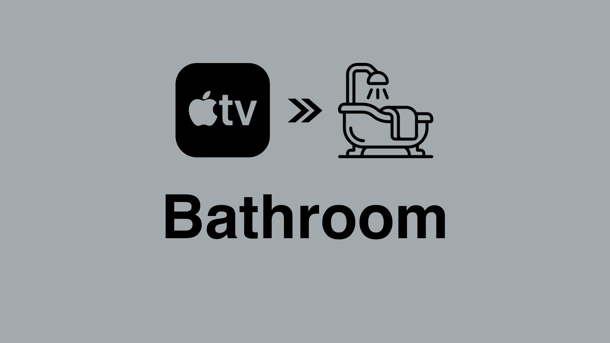](output/bathroom_en.png) | [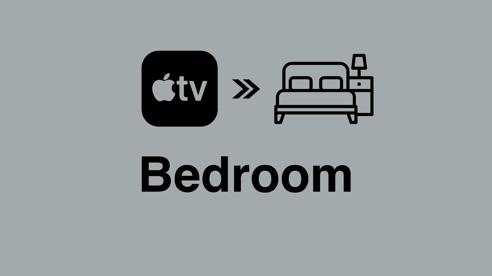](output/bedroom_en.png) | [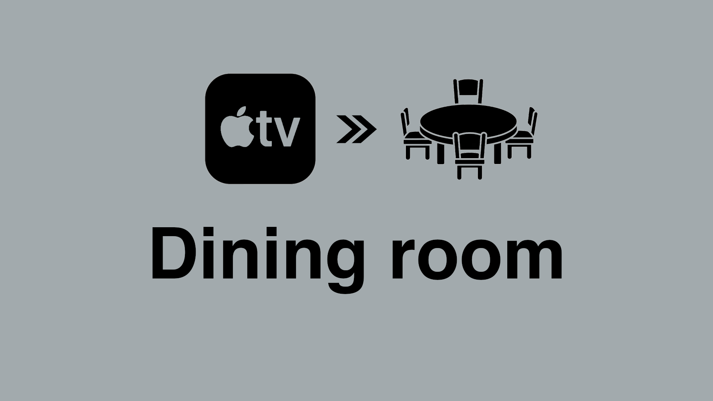](output/diningroom_en.png) |
| [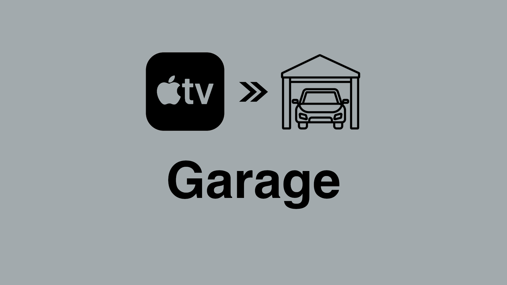](output/garage_en.png) | [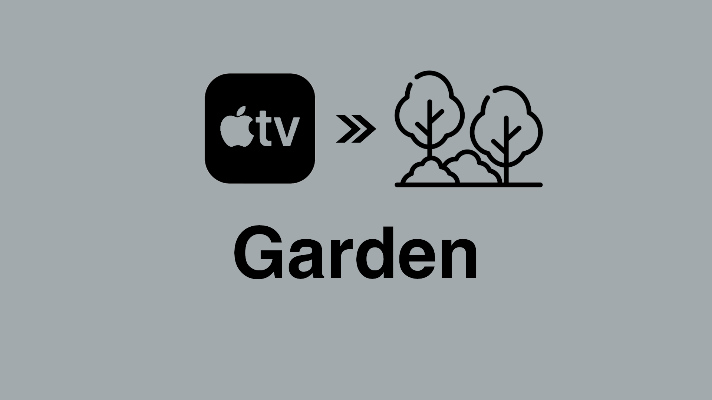](output/garden_en.png) | [](output/gym_en.png) |
| [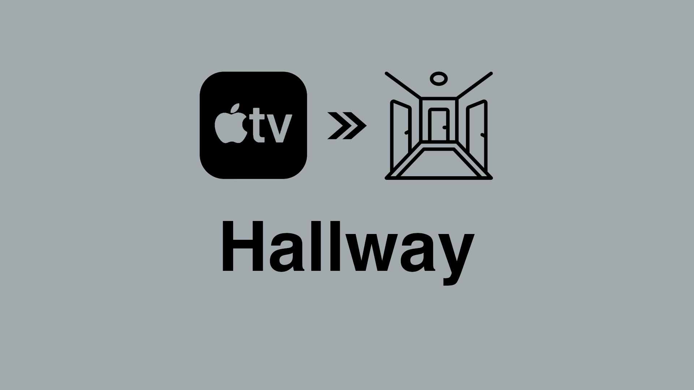](output/hallway_en.png) | [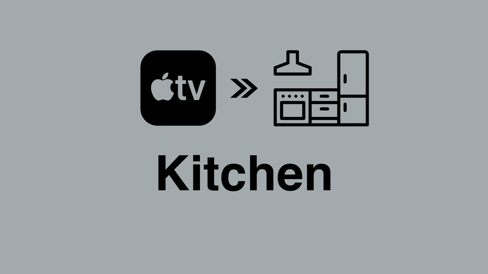](output/kitchen_en.png) | [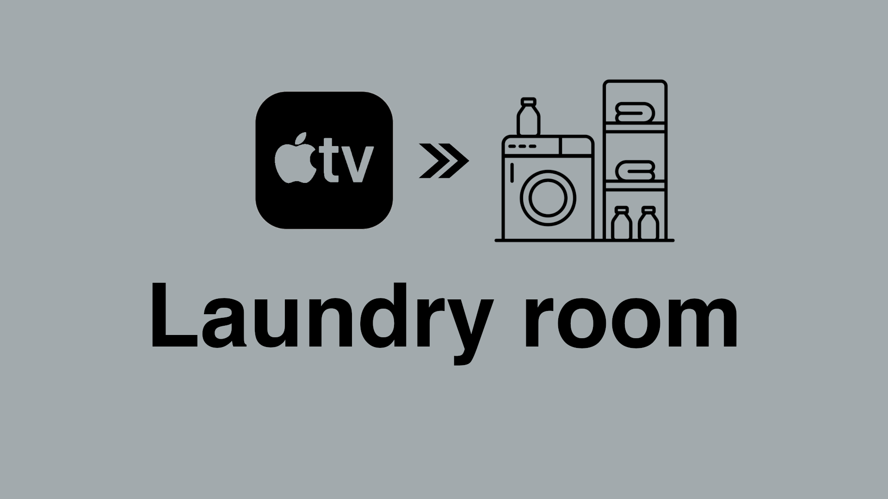](output/laundry_en.png) |
| [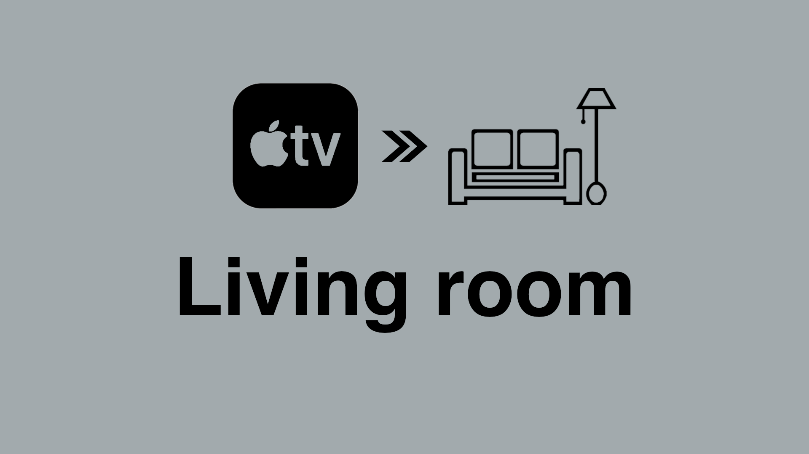](output/livingroom_en.png) | [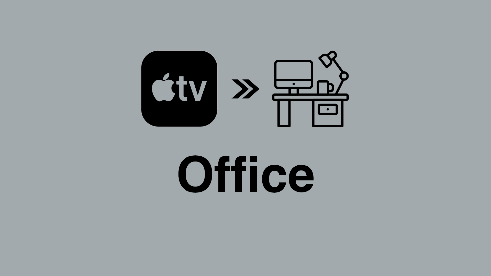](output/office_en.png) | [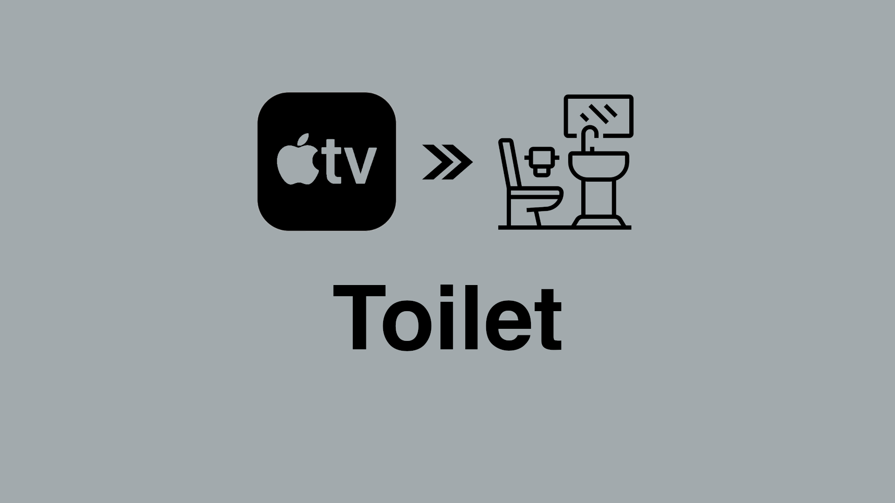](output/toilet_en.png) |

## Development

The source XCF image is made using [Gimp](https://gimp.org) and is located in ```src```. If you have Gimp installed you
can auto-generate ```png``` files by running the script ```generate_icons.sh```. The generated images will be rendered
in the ```output``` directory.

### Adding a new language

Edit file ```src/translations.scm``` and append a block to languages:

```
  (list "sv" (list
    (cons "diningroom" "Matsal")
    (cons "kitchen"    "Kök")
    ; ... one line per room-key ...
    (cons "gym"        "Gym")))
```
Then run ```./generate_icons.sh``` and you'll get ```diningroom_sv.png```, ```kitchen_sv.png``` etc. in the ```output``` 
directory. No GIMP work needed :) 

You can also point at an alternate data file with ```HK_TRANS=/path/to/other.scm ./generate_icons.sh```.

Enjoy!

